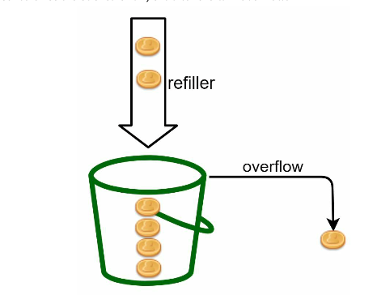
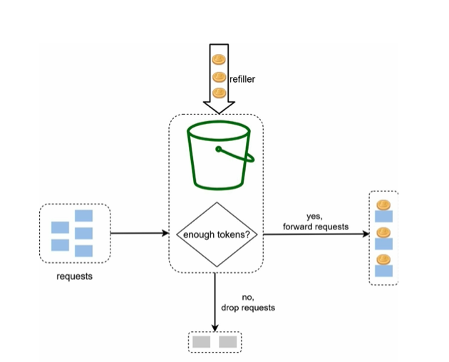
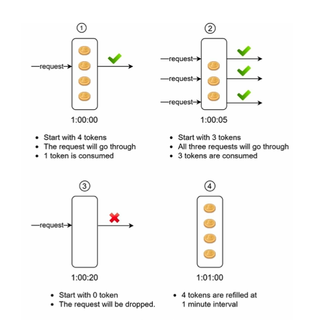

# Token bucket for gin middleware

## Algorithm work

The token bucket algorithm work as follows:

- A token bucket is a container that has pre-defined capacity. Tokens are put in the bucket at preset rates periodically. Once the bucket is full, no more tokens are added.


<br>
<br>
<p align="center">
  
</p>


- Each request consumes one token. When a request arrices, we check if there are enough token in the bucket.
    - If there are enough tokens, we take one out for each request, and the request goes through.
    - If there are not enough tokens, the request is dropped.

<br>
<br>
<p align="center">
  
</p>

<br>
<br>
<p align="center">
  
</p>


The token bucket algorithm takes two parameters:
- Bucket size: the maximum number of tokens allowed in the bucket.
- Refill rate: number of tokens put into the bucket every second.

How many buckets do we need? This varies, and it depends on the rate-limiting rules. Here are a few examples.
- It is usually necessary to have different buckets for different API endpoints. For instance, if a user is allowed to make 1 post per second, add 150 friends per day, and like 5 posts per second, 3 buckets are required for each user.
- If we need to throttle requests based on IP addresses, each IP address requires a bucket.
- If the system allows a maximum of 10,000 requests per second, it makes sense to have a global bucket shared by all requests.

Pros: 
- The algorithm is easy to implement.
- Memmory afficient.
- Token bucket allows a burst of traffic for short periods. A request can go through as long as there are tokens left.

Cons:
- Two parameters in the algorithm are bucket size and token refill rate. However, it might be challenging to tune them properly.

## Run

1. Run server 
```
make server
```
2. Test 
```
make test
```
